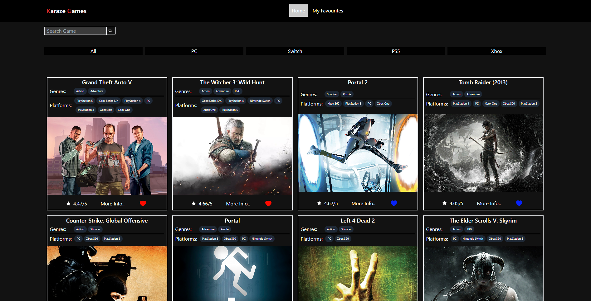
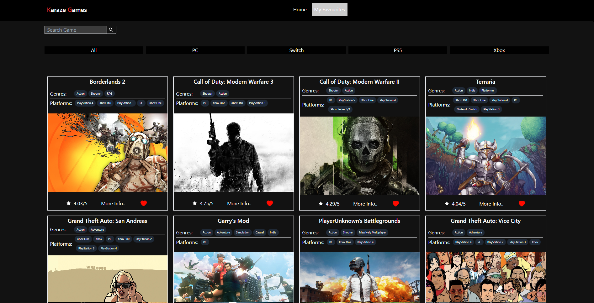

# GamesListApp

## Preview

### Desktop
#### Home Page


#### Favourites Page



## Deployed Version

* [Link]( https://vercel.com/edrickhoo/games-list-app)

## Setup

* To install dependencies open terminal cd into the root folder
 ```
 npm install
 ```
 * Run Application
 ```
 npm run dev
 ```

## Description of project (spec / MVP)

### Outline
This project is designed to reinforce your React learnings and make sure that you are comfortable with most aspects of the framework. With this project you will practice how to:
* Fetch Data within a React App
* Prop drilling
* Use state and effect React hooks
* Conditional Rendering
* Use react router dom

### MVP:

* Home Page
  - A Grid of games -- [x]
  - As a user beable to filter through games on page by console -- [x]
  - As a user beable to favourite/favourite a game -- [x]
  - As a user beable to view more information of a game which causes a modal to pop up -- [x]
  - As a user beable to search for specific titiles -- [x]
  
* Favourite Page
  - Store favourites in local storage to be accessed on reopen/refresh -- [x]
  - Display favourited games -- [x]
  - As a user beable to favourite/unfavourite a game -- [x]
  - As a user beable to search through favourited games -- [x]
  - As a user beable to filter through favourited games by console -- [x]
  
 * Ensure application is responsive on both mobile and desktop -- [x]
  

## Approach

* Looked at similar web applications online to see how functionality worked in these list search type apps.
* Researched the rawgAPI docs and tested end points to see what type of data and structure that is returned.
* This was my first major project with react, so there was lots of trial and error with react in general, researching react docs and videos on state useEffect was crucial in learning what i need to complete this project.
* At first the project was basic only to fetched a query search and display list of games, additional feature were added slowly once basic functionality was done.
* Styling was done with tailwindCSS which uses utility classes to style elements.
* Additional libraries:
  - react-router-dom - Used to create routes in the application.
  - react-icons - Library used to display icons like heart and star icons.


## Reflection
* What went well?
  - Fetching data asynchronously and mapping through it to display it on the page went well even though I was not too familiar with it at the time. Styling with TailwindCSS was able to be done quite quickly and well.
* What are you proud of? 
  - I am proud that my understanding of learning how to research concepts that you dont dunno increased. Overall I better understand how to fetch data, the useState hook, useEffect hook, map through data, filter through data, how to get user input, saving data to local storage and how to use react router.
* What was a challenge?
  - As it was my first react project I found how to correctly use useEffect and when to useState challenging, sometimes causing an infinite loop in the useEffect. But through researching and watching videos on these topics I was able to overcome the challenges and complete the web app.
* What you'd do differently?
  - Not store the favourites as an array of objects in local storage. As in a case where favourites are stored but the live data is updated for example the rating stored in local favourites is a 3/5 but the live search of the same game is updated to a 4/5 rating. The local stoarge data would be not up to date. To solve this I would like to store a an array of unique IDs of my favourited games, and when I change to the favourites route use a useEffect and map through the the local storage array of ids putting them in a fetch() with rawgAPI url with search query with each id in the array. After it would use a proimse.All() to fetch all results at once and then set favourites state to the array of objects that comes back to be rendered.

## Future Goals

* Change local favourite stoarge to store game unique ID to be refetched to get up to date data.
* Add testing.
* Style the page better, with a color palette.


## Further reading or links to inspiration

*  [Using the State Hook - React]( https://reactjs.org/docs/hooks-state.html)
*  [React Router]( https://reactrouter.com/en/main/start/overview)
*  [React Hooks Video]( https://www.youtube.com/watch?v=O6P86uwfdR0&list=PLZlA0Gpn_vH8EtggFGERCwMY5u5hOjf-h)

## Stay in touch

*  [Portfolio]( https://edric-khoo.vercel.app/)
*  [Linkedin]( https://www.linkedin.com/in/edric-khoo-98881b173/)


